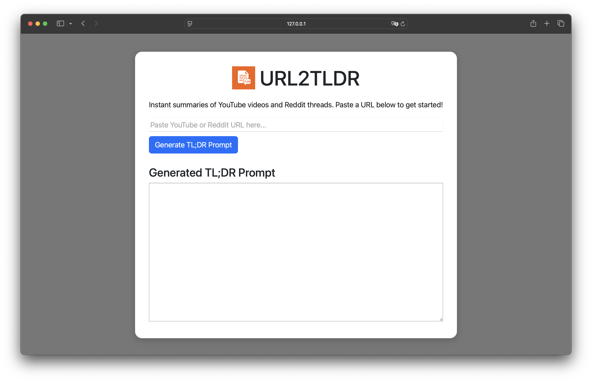

[](./LICENSE)
[]()
[]()

# URL2TLDR

URL2TLDR is a Dash app that generates TL;DR prompts for online content.

## 📖 Description

URL2TLDR is a lightweight Dash app that helps you prepare TL;DR prompts for online content:

- 🎥 YouTube → generates a prompt based on video captions
- 📰 Reddit → generates a prompt based on thread comments
- ⚠️ Any other URL will display a warning

Simply paste a URL, and URL2TLDR will create a ready-to-use prompt that you can later provide to your preferred LLM (e.g., Ollama, ChatGPT, Gemini, Claude, etc.) to obtain a concise summary.

## 🚀 Features

- Paste a URL (YouTube or Reddit)
- Automatic content extraction (captions or comments)
- Generates a ready-to-use TL;DR prompt for any LLM (ChatGPT, Ollama, etc.)
- Simple, clean Dash interface

## 🛠️ Installation

1. **Clone the repository:**
   ```bash
	git clone https://github.com/Noe-AC/url2tldr.git
	cd url2tldr
   ```

2. **Create a virtual environment (recommended):**
   ```bash
	python3 -m venv venv
   ```

3. **Activate the virtual environment:**

- On macOS / Linux:
   ```bash
	source venv/bin/activate
   ```
- On Windows (Command Prompt):
   ```bash
	venv\Scripts\activate.bat
   ```
- On Windows (PowerShell):
   ```bash
	venv\Scripts\Activate.ps1
   ```

4. **Install the requirements:**
   ```bash
	pip install -r requirements.txt
   ```

5. **Run the app:**
   ```bash
	python app.py
   ```

## 🧩 Requirements

The URL2TLDR Dash app requires the following Python libraries:

- ``dash`` and ``dash-bootstrap-components``: for the user interface.
- ``requests``: to fetch web content.
- ``pandas``: for data manipulation.
- ``yt-dlp``: to fetch Youtube video metadata.
- ``youtube-transcript-api``: to fetch YouTube video transcripts.
- ``ollama``: to run ollama prompts from inside the app.

## 💡 Usage

1. Launch the URL2TLDR Dash app with ``python app.py``.
2. Paste a YouTube video URL or a Reddit thread URL.
3. Review the extracted text (captions or comments).
4. Copy the generated TL;DR prompt.
5. Paste the prompt into your preferred LLM (ChatGPT, Ollama, etc.) to generate a summary.

## 📸 Screenshots



## ⚖️ License

This project is licensed under the MIT License — see the [LICENSE](./LICENSE) file for details.
