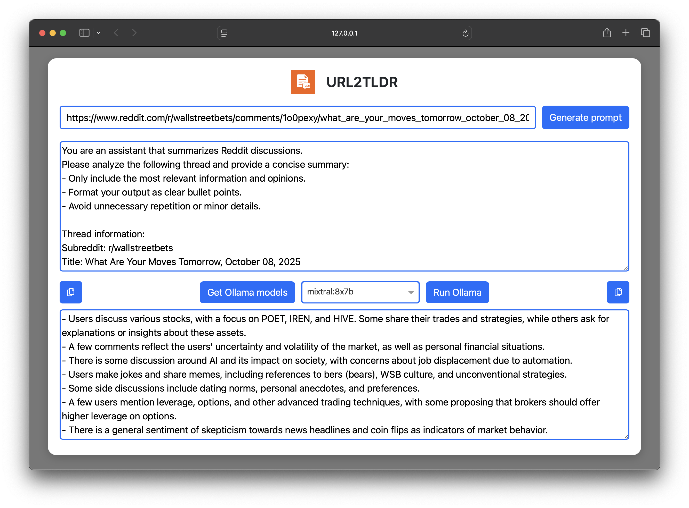

[](./LICENSE)
[]()
[]()

# URL2TLDR

URL2TLDR is a lightweight Dash app that extracts and summarizes online content such as YouTube videos and Reddit threads — producing both TL;DR prompts and concise summaries.

## ✨ Features

- 🎥 YouTube: extracts video captions
- 📰 Reddit: extracts thread discussions
- ✏️ Prompt generation: creates ready-to-use TL;DR prompts for your favorite LLM
- 🤖 Direct summarization: uses your local Ollama models to generate summaries
- 🖥️ User-friendly interface: copy results with one click, switch models easily, and enjoy a clean, responsive design

## 🛠️ Installation

Make sure Python 3.9+ is installed with pip.

**Install the `url2tldr` library:**
   ```bash
	pip install git+https://github.com/Noe-AC/url2tldr.git
   ```
This will add the `url2tldr` command to your PATH.

## 🧩 Requirements

**Python libraries (installed automatically via pip):**

- ``dash`` and ``dash-bootstrap-components``: for the user interface.
- ``requests``: to fetch web content.
- ``pandas``: for data manipulation.
- ``yt-dlp``: to fetch Youtube video metadata.
- ``youtube-transcript-api``: to fetch YouTube video transcripts.
- ``ollama``: to run ollama prompts from inside the app.

**External requirements:**

- Ollama CLI must be installed and configured if you want to use Direct summarization mode. Without Ollama, URL2TLDR will still generate TL;DR prompts, but cannot generate summaries directly in-app.

## 💡 Usage

1. Launch the app:
   ```bash
	url2tldr [optional URL]
   ```
    You can optionally provide a YouTube or Reddit URL directly when launching.
2.	Paste a URL
    -	YouTube video or Reddit thread
3.	Review extracted content
    - Captions (YouTube) or thread comments (Reddit)
4.	Generate TL;DR prompt
    - The app automatically creates a ready-to-use prompt from the extracted content.
	- Optionally, run the prompt directly in-app using your local Ollama model.
5.	Review and copy results
    - Copy the generated prompt or summary with one click.


## 📸 Screenshots



## ⚖️ License

This project is licensed under the MIT License — see the [LICENSE](./LICENSE) file for details.
