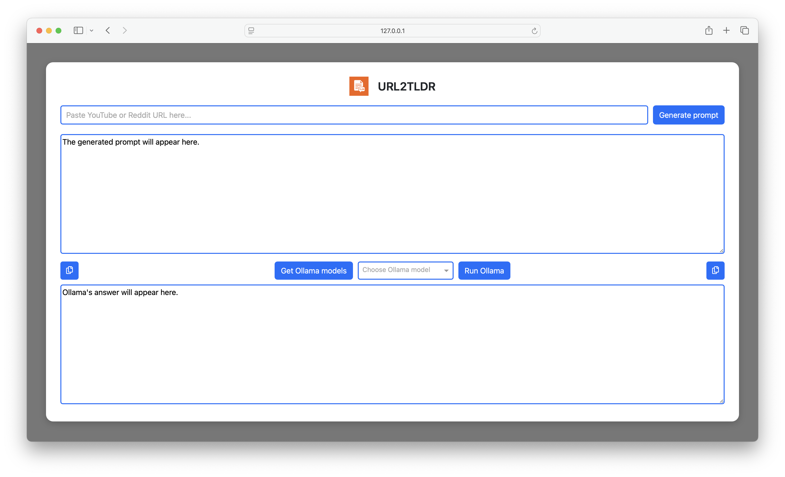

[](./LICENSE)
[]()
[]()

# URL2TLDR

URL2TLDR is a Dash app that generates TL;DR prompts for online content.

## 📖 Description

URL2TLDR is a lightweight Dash app that helps you prepare TL;DR prompts for online content:

- 🎥 YouTube → generates a prompt based on video captions
- 📰 Reddit → generates a prompt based on thread comments
- ⚠️ Any other URL will display a warning

Simply paste a URL, and URL2TLDR will create a ready-to-use prompt that you can later provide to your preferred LLM (e.g., Ollama, ChatGPT, Gemini, Claude, etc.) to obtain a concise summary.

## 🚀 Features

- Paste a URL (YouTube or Reddit)
- Automatic content extraction (captions or comments)
- Generates a ready-to-use TL;DR prompt
- Direct integration with **Ollama** models
- Simple, clean, and responsive Dash interface
- Copy prompts or results to clipboard with one click
- Choose Ollama model from a dropdown and run it directly in-app

## 🛠️ Installation

Make sure Python 3.9+ is installed with pip.

1. **Install the library:**
   ```bash
	pip install git+https://github.com/Noe-AC/url2tldr.git
   ```

2. **Run the app:**
   ```bash
	url2tldr
   ```

## 🧩 Requirements

The URL2TLDR Dash app requires the following Python libraries:

- ``dash`` and ``dash-bootstrap-components``: for the user interface.
- ``requests``: to fetch web content.
- ``pandas``: for data manipulation.
- ``yt-dlp``: to fetch Youtube video metadata.
- ``youtube-transcript-api``: to fetch YouTube video transcripts.
- ``ollama``: to run ollama prompts from inside the app.
- Ollama CLI installed and configured (for running models directly)

## 💡 Usage

1. Once installed, launch the URL2TLDR Dash app with the bash command ``url2tldr``.
2. Paste a YouTube video URL or a Reddit thread URL.
3. Review the extracted text (captions or comments).
4. Copy the generated TL;DR prompt.
5. Paste the prompt into your preferred LLM (ChatGPT, Ollama, etc.) to generate a summary.
6. Optionally select an Ollama model and click *Run Ollama* to get a summary directly in the app.

## 📸 Screenshots



## ⚖️ License

This project is licensed under the MIT License — see the [LICENSE](./LICENSE) file for details.
